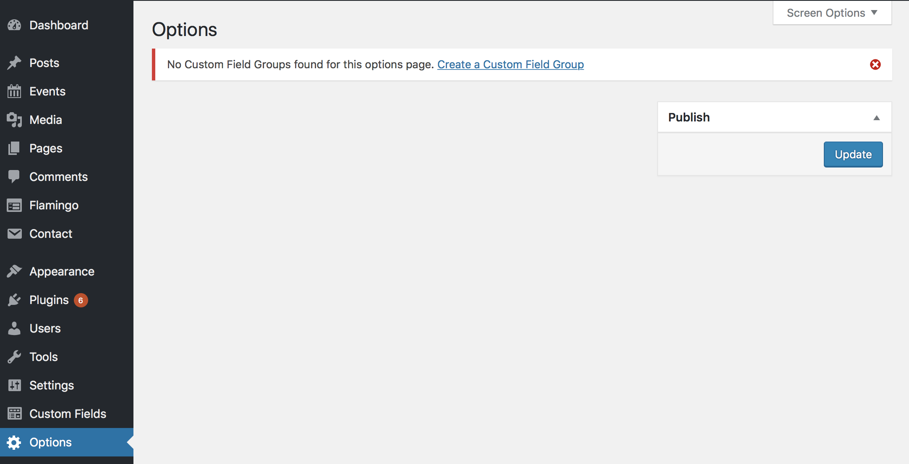

—
layout: post
title:  Creating an ACF Options Page
date:   2018-08-11 14:49:23 -0500
categories: wordpress acf
—
[Advanced Custom Fields](advancedcustomfields.com) just never stops finding new ways to be cool. Or rather, I just can’t stop discovering new ways in which ACF is even cooler than I thought.

The most recent (accidental) discovery I’ve made is how to create a built-in options page for your site. This is incredibly convenient as the options page is “Universal” meaning you can call its fields from any page on the site without having to set up a custom loop.

> This is in contrast to how I had previously created “Options Pages” which was to have an actual page titled _Options_ (or _Footer_ or whatever) that I would then reference with a custom query like so  
```
<?php $custom_query = new WP_Query('pagename=footer');
while($custom_query->have_posts()) : $custom_query->the_post(); ?>
```

With an actual Options Page all of the field information is available globally so if you’re already in a loop, you have access to your options.

Pretty handy right? Let’s get it hooked up.

## Activating the Options Page
Turning on the Options… option is super simple. Just add the following lil’ bit of code to your `functions.php` file.
```
if( function_exists(‘acf_add_options_page’) ) {

	acf_add_options_page();

}
```

Once you save and reload you’ll see this in your admin.



Cool huh? No surprise that you don’t have any Field Groups yet since you likely haven’t assigned any. We’ll get to that in a second.
